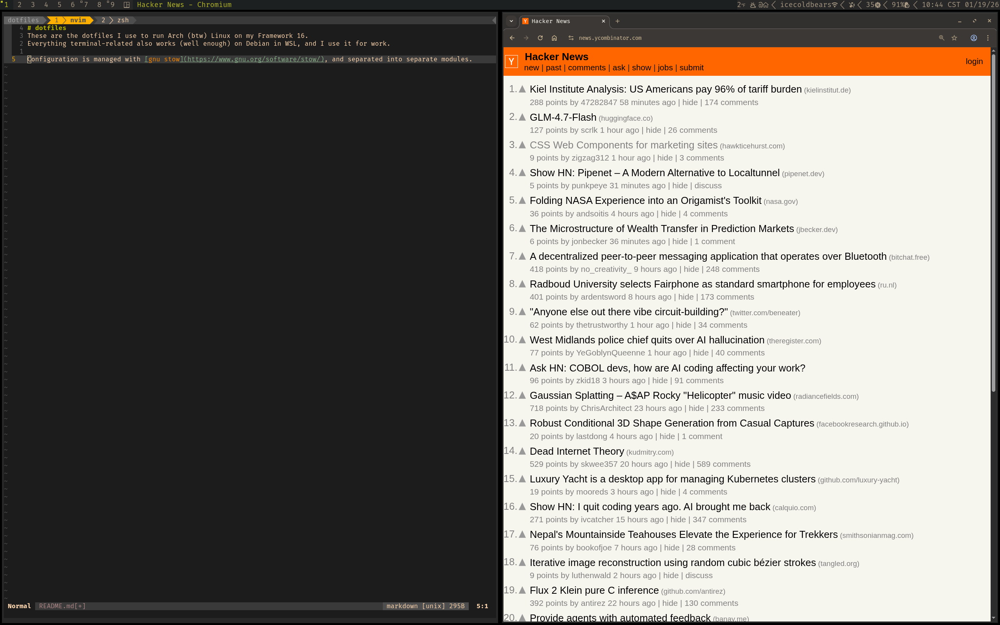

# dotfiles
These are the dotfiles I use to run Arch (btw) Linux on my Framework 16.
Everything terminal-related also works (well enough) on Debian in WSL, and I use it for work.

Configuration is managed with [gnu stow](https://www.gnu.org/software/stow/), and separated into separate modules.
It's fairly organized.

Here's a screenshot of what it looks like all together.

